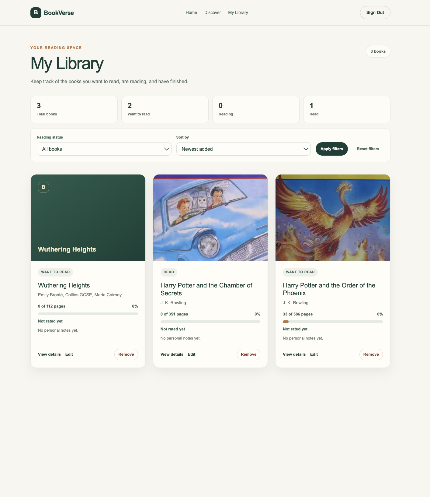
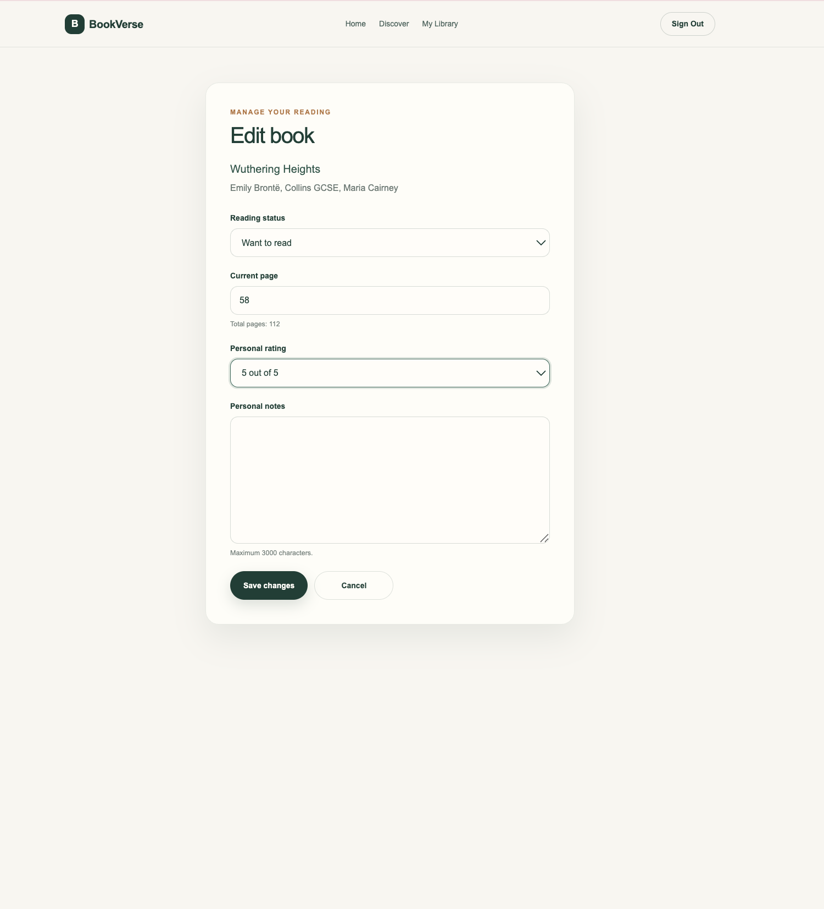

# BookVerse

A full-stack personal reading library built with Next.js, Supabase, and Open Library.

BookVerse helps readers discover books, save them to a private library, and keep track of their reading journey in one calm, responsive interface.

## Features

- Search books through Open Library
- View detailed book information
- Email and password authentication
- Personal reading library
- Reading statuses
- Reading progress
- Personal ratings
- Notes
- Library statistics
- Filtering and sorting
- Responsive design

## Screenshots

### Home page


### Book search


### Book details


### Personal library



### Edit reading progress



## Technologies

- Next.js App Router
- React
- TypeScript
- CSS Modules
- Supabase Auth
- Supabase PostgreSQL
- Row Level Security
- Open Library API
- Vercel

## Architecture

Open Library provides the public book catalog. A Next.js Route Handler requests and normalizes that external data before returning it to the application. Supabase manages authentication and stores each reader's personal library in PostgreSQL. Row Level Security isolates data between users, while Next.js Server Actions perform authenticated library mutations.

## Local setup

Clone the repository and install its dependencies:

```bash
git clone https://github.com/tanialapa/bookverse.git
cd bookverse
npm install
```

Create `.env.local` in the project root and add the environment variables listed below. Then start the development server:

```bash
npm run dev
```

Open `http://localhost:3000` in your browser.

## Environment variables

```env
NEXT_PUBLIC_SUPABASE_URL=
NEXT_PUBLIC_SUPABASE_PUBLISHABLE_KEY=
```

Use the URL and publishable key from your Supabase project settings. Keep local environment files out of Git and never expose a secret or service-role key in the application.

## Database setup

1. Open the SQL Editor in your Supabase project.
2. Run `supabase/sql/create_user_books.sql` to create the personal library table and its policies.
3. Run `supabase/sql/verify_user_books.sql` to verify the schema and security configuration.

## Scripts

- `npm run dev` starts the local development server.
- `npm run lint` runs ESLint.
- `npm run build` creates a production build.
- `npm start` serves the production build.

## Security

- Secrets and local environment files are not committed.
- User data is protected by Row Level Security.
- `user_id` is derived from the authenticated Supabase session, not from form or URL input.
- External book data is normalized server-side before it reaches the UI or database.

## Deployment

The repository can be imported into Vercel as a Next.js project. Add `NEXT_PUBLIC_SUPABASE_URL` and `NEXT_PUBLIC_SUPABASE_PUBLISHABLE_KEY` to the Vercel project environment variables before deploying. The Supabase database schema must also be configured as described above.

## Future improvements

- Password reset
- Social authentication
- Pagination
- Reading goals
